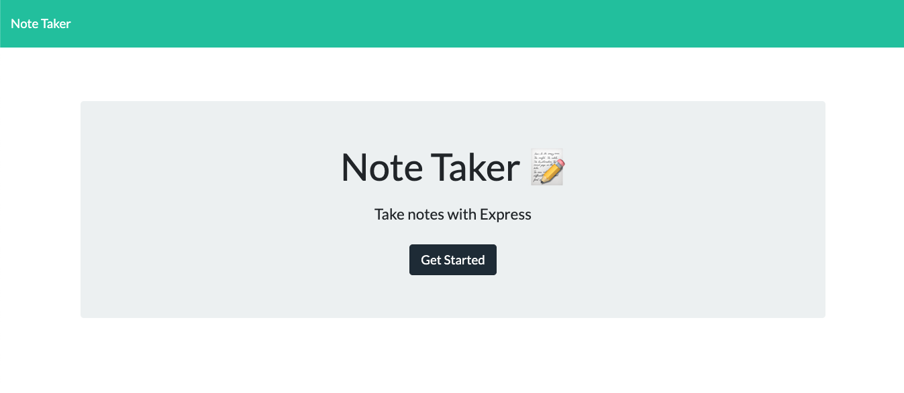
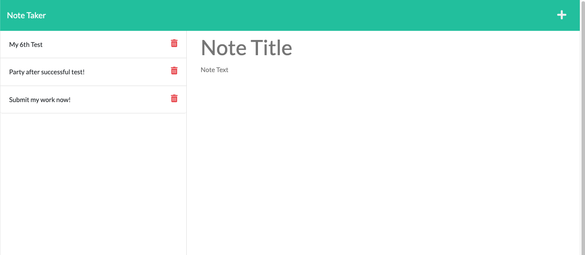
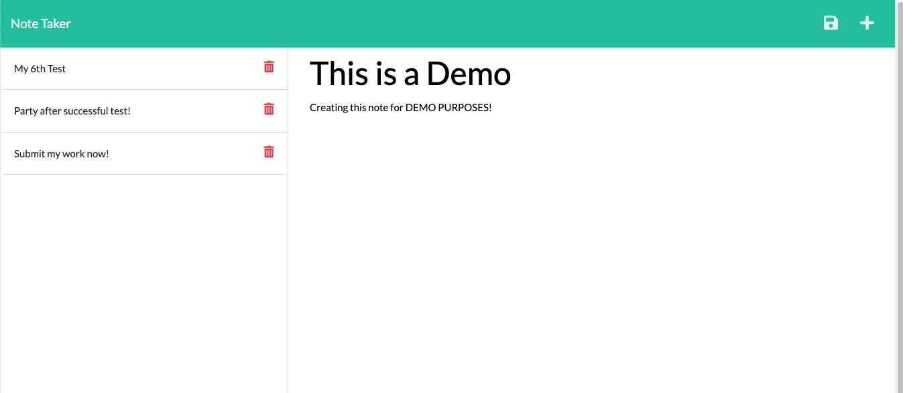
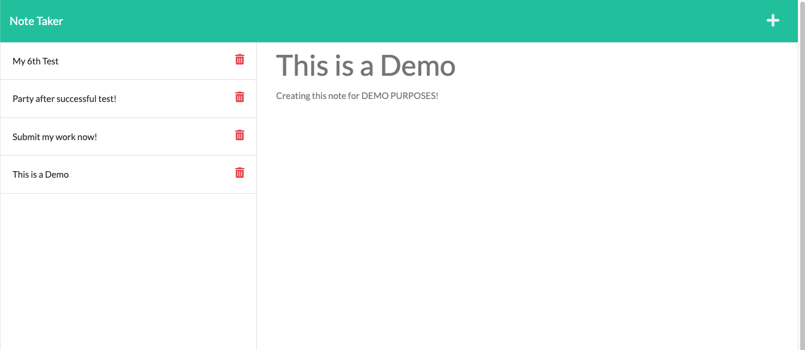

# Note Taker

## Description
This application called Note Taker that can be used to write, save and delete notes. This application will use an Express.js back end and will save and retrieve note data from a JSON file.

This app uses the following technologies:
- [Express.js](https://www.npmjs.com/package/express)
- [Node.js](https://nodejs.org/en/)
- [uuid npm](https://www.npmjs.com/package/uuid)

## User Story and Criteria
- AS A small business owner
- I WANT to be able to write and save notes
- SO THAT I can organize my thoughts and keep track of tasks I need to complete

- GIVEN a note-taking application
- WHEN I open the Note Taker
- THEN I am presented with a landing page with a link to a notes page
- WHEN I click on the link to the notes page
- THEN I am presented with a page with existing notes listed in the left-hand column, plus empty fields to enter a new note title and the note’s text in the right-hand column
- WHEN I enter a new note title and the note’s text
- THEN a Save icon appears in the navigation at the top of the page
- WHEN I click on the Save icon
- THEN the new note I have entered is saved and appears in the left-hand column with the other existing notes
- WHEN I click on an existing note in the list in the left-hand column
- THEN that note appears in the right-hand column
- WHEN I click on the Write icon in the navigation at the top of the page
- THEN I am presented with empty fields to enter a new note title and the note’s text in the right-hand column

## Table of Contents

* [Installation](#installation)
* [Usage](#usage)
* [License](#license)
* [Contributing](#contributing)
* [Tests](#tests)
* [Questions](#questions)
* [Links](#links)

## Installation

To use this application, please follow the following steps:
- Clone the repository using SSH - 'git clone git@github.com:khanhlam90/note-taker.git'
- Run npm to install the express - 'npm install express' or 'npm i express'
- Run npm to install the uuid - 'npm install uuid' or 'npm i uuid'
- To host your own app, first sign up a free [Heroku Account](https://www.heroku.com/), then from the command line, install Heroku - 'brew tap heroku/brew && brew install heroku' (for Mac users). For Window users, please visit Heroku for details.
- After installing Heroku, from command line, create new project - 'heroku create desiredAppName'
- Using Git command line - 'git add -A', 'git commit -m "details of the commit"', then 'git push heroku main'
- Users should now see an url link to their app from the command line (note that the link should end in .com). For example, https://expressjs-notetakr.herokuapp.com/
- Note that users could perform the same Git command line to push changes to their Github - 'git push origin main' (or whatever branch they desire).

## Usage 
After the installation, please access your Heroku URL Link. For example, [Note Taker](https://expressjs-notetakr.herokuapp.com/)
- [Link to the active application](https://expressjs-notetakr.herokuapp.com/)
- Screenshot of Note Taker Landing Page:

- Screenshot of Note Taker Page (After Clicking on Get Started):

- Screenshot of Creating New Note (Demo) - Hit The Plus Sign And Enter The Note Details:

- Screenshot of New Notes (Demo) Being Saved To The Left Columns And Its Details:

- Screenshot of New Notes (Demo) Being Deleted From The Left Columns:

## License

This project is using the MIT License.

## Contributing

Please feel free to contribute to this project - please find my info at the [Questions](#questions) section and contact me for more infomation.

## Tests

Please refer to [Usage](#usage) section.

## Questions

Please reach me using:

<a href = "mailto:khanhlam1990@yahoo.com"> My Email </a>

[My Github Account](https://github.com/khanhlam90)

## Project Links:
* [Link to the active application](https://expressjs-notetakr.herokuapp.com/)
* [This Github Repository](https://github.com/khanhlam90/note-taker.git)

